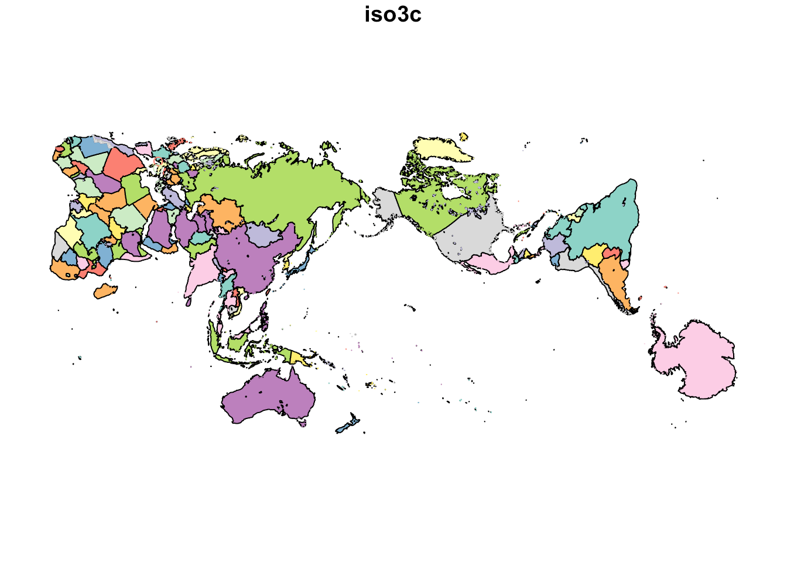
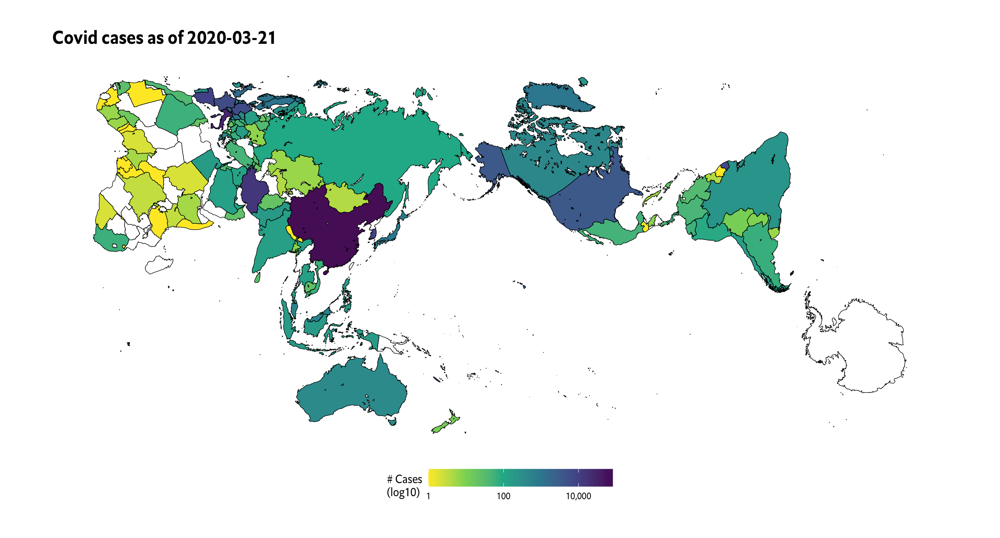

[](https://www.repostatus.org/#active)
[](https://keybase.io/hrbrmstr)

[](https://travis-ci.org/hrbrmstr/imago)  


# imago

Hacky World Map GeoJSON Based on the Imago Projection

## Description

In 2017, Justin Kunimune reverse engineerd
(<https://kunimune.home.blog/2017/11/23/the-secrets-of-the-authagraph-revealed/>)
and open sourced the proprietary AuthaGraph
(<http://www.authagraph.com/top/?lang=en>) projection. Tools are
provided to use this map in R for making global choropleth charts.

## What’s Inside The Tin

The following functions are implemented:

## Installation

``` r
remotes::install_git("https://git.rud.is/hrbrmstr/imago.git")
# or
remotes::install_git("https://git.sr.ht/~hrbrmstr/imago")
# or
remotes::install_gitlab("hrbrmstr/imago")
# or
remotes::install_bitbucket("hrbrmstr/imago")
```

NOTE: To use the ‘remotes’ install options you will need to have the
[{remotes} package](https://github.com/r-lib/remotes) installed.

## NOTE

This is really only suitable for choropleths. You’re not going to be
able to plot lon/lat on this since it was a hacky conversion from an SVG
file to a woefully inaccurate projected GeoJSON, done mostly for a
friend.

## Usage

``` r
library(imago)

# current version
packageVersion("imago")
## [1] '0.1.0'
```

``` r
plot(imago())
## Reading layer `imago-final' from data source `/Library/Frameworks/R.framework/Versions/3.6/Resources/library/imago/geojson/imago-final.geojson' using driver `GeoJSON'
## Simple feature collection with 401 features and 1 field
## geometry type:  GEOMETRY
## dimension:      XY
## bbox:           xmin: -121.9723 ymin: 37.37338 xmax: -121.969 ymax: 37.37454
## epsg (SRID):    4326
## proj4string:    +proj=longlat +datum=WGS84 +no_defs
```



``` r
library(hrbrthemes)
library(countrycode)
library(tidyverse)

cols(
  .default = col_double(),
  date = col_date(format = "")
) -> covid_cols

read_csv(
  file = "https://covid.ourworldindata.org/data/who/total_cases.csv",
  col_types = covid_cols
) %>% 
  tail(1) %>%
  gather(country, cases, -date) %>%
  filter(!(country %in% c("World", "International", "Saint Barthlemy"))) %>%
  mutate(iso3c = countrycode(country, "country.name", "iso3c")) %>%
  select(-date, -country) -> covid_global

left_join(
  imago(quiet = TRUE, stringsAsFactors = FALSE), 
  covid_global,
  by = "iso3c"
) %>%
  ggplot() +
  geom_sf(
    aes(fill = cases), color = "black", size = 0.25
  ) +
  scale_fill_viridis_c(
    name = "# Cases\n(log10)", na.value = "white",
    direction = -1, trans = "log10", label = scales::comma
  ) +
  coord_sf(datum = NA) +
  labs(title = sprintf("Covid cases as of %s", Sys.Date())) +
  theme_ipsum_es(grid="") +
  theme(legend.key.width = unit(2.5, "lines")) +
  theme(legend.position = "bottom")
```



## imago Metrics

| Lang | \# Files |  (%) | LoC |  (%) | Blank lines |  (%) | \# Lines |  (%) |
| :--- | -------: | ---: | --: | ---: | ----------: | ---: | -------: | ---: |
| Rmd  |        1 | 0.25 |  43 | 0.83 |          22 | 0.92 |       34 | 0.61 |
| R    |        3 | 0.75 |   9 | 0.17 |           2 | 0.08 |       22 | 0.39 |

## Code of Conduct

Please note that this project is released with a Contributor Code of
Conduct. By participating in this project you agree to abide by its
terms.
